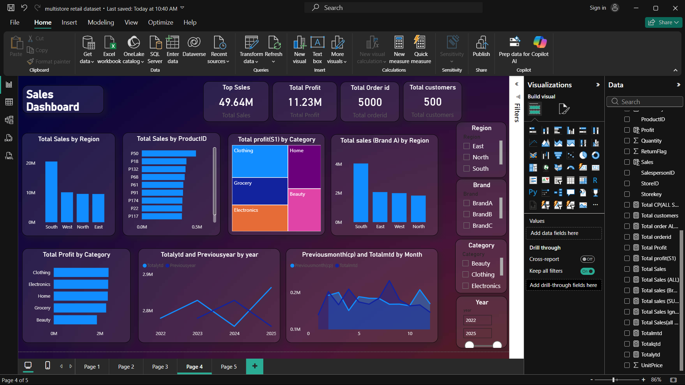

# 📊 Sales Performance Dashboard | Power BI

> An interactive Business Intelligence dashboard built using **Power BI** to analyze sales performance, profit trends, customer behavior, and regional insights.

---

## 📷 Dashboard Preview



---

## 📌 Project Overview

This project demonstrates how Power BI can transform raw sales data into meaningful business insights through interactive dashboards and visualizations. The dashboard enables users to monitor KPIs, identify trends, compare regional performance, and support data-driven decision-making.

---

## 🎯 Objectives

- Analyze sales performance
- Monitor profit and revenue
- Compare regional sales
- Identify top-performing products
- Track monthly sales trends
- Build an interactive dashboard for business users

---

## 📊 Key Performance Indicators (KPIs)

- 💰 Total Sales
- 📈 Total Profit
- 📦 Total Quantity Sold
- 🧾 Total Orders
- 📊 Profit Margin
- 📅 Monthly Sales Growth

---

## 📈 Dashboard Features

- Interactive Filters & Slicers
- Region-wise Sales Analysis
- Category-wise Performance
- Product-wise Sales Analysis
- Monthly Sales Trend
- Profit Analysis
- KPI Cards
- Clean & Interactive Dashboard Design

---

## 🛠️ Tools & Technologies

| Tool | Purpose |
|------|---------|
| Power BI | Dashboard Development |
| Power Query | Data Cleaning & Transformation |
| DAX | Calculations & Measures |
| Excel | Dataset |
| Data Modeling | Relationship Management |

---

## 📂 Repository Structure

```text
PowerBI-Sales-Dashboard/
│
├── Sales_Dashboard.pbix
├── Sales_data.xlsx
├── Dashboard_screenshot.png
├── conceptual model.docx
└── README.md
```

---

## 📊 Business Insights

- Identified high-performing products and categories.
- Compared sales performance across different regions.
- Analyzed monthly sales growth trends.
- Evaluated profit distribution across categories.
- Built an interactive dashboard for quick business decision-making.

---

## 🚀 Skills Demonstrated

- Data Cleaning
- Data Transformation
- Data Modeling
- DAX Functions
- Power Query
- Dashboard Design
- Business Intelligence
- Data Visualization
- Analytical Thinking

---

## ▶️ How to Use

1. Download or clone this repository.
2. Open `Sales_Dashboard.pbix` using Microsoft Power BI Desktop.
3. Refresh the dataset if required.
4. Explore the dashboard using interactive filters and slicers.

---

## 📂 Dataset

- **Source:** Sample Sales Dataset
- **Format:** Excel (.xlsx)

> Replace the dataset with a sample version before sharing publicly if it contains confidential information.

---

## 👨‍💻 Author

**Shivam Kumar Singh**

🎓 B.Tech (CSE - AI & ML)

📊 Aspiring Data Analyst

### Skills

- Microsoft Excel
- SQL
- Power BI
- Power Query
- DAX
- Python (Learning)
- Data Visualization
